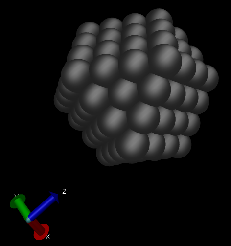

Building/cutting a shape
========================

Growing shapes from a seed file 
################################

The Bravais theory says that a crystal face will grow
faster is the atom/unit cell that is added to the face 
finds a higher coordination. In this way, faces that have 
a high reticular density will grow slower since the adatom
will potentially find only a "top" position. 

Here we give an example of how to grow a shape from a seed 
using only geometrical parameters which are: the ``MinCoordination``
and the ``RCut``. ``RCut`` is used as a criterion to search for the 
coordination. If the adatom (possible atom to be included in the 
shape) has 3 atoms that are within ``RCut``, the coordination of 
such an adatom will be 3. If ``MinCoordination = 2``, the the adatom 
with coordination = 3 will be included in the shape. 

An exaple input file is given as follows: 

.. code-block:: bash

  #Lcc input file.
  LCC{
   JobName=                 AgBulk        #Or any other name

   ClusterType=             BravaisGrowth
   NumberOfIterations=      3
   RTol=                    0.01
   MaxCoordination=         1
   RCut=                    3.5
   SeedFile=                "seed.pdb" 

   TypeOfLattice=           FCC
   LatticePointsX1=        -8             #Number of point in the direction of the first Lattice Vector
   LatticePointsX2=         8
   LatticePointsY1=        -8
   LatticePointsY2=         8
   LatticePointsZ1=        -8
   LatticePointsZ2=         8
   AtomType=                Ag
   PrimitiveFormat=         Angles        #Will use angles and edges
   LatticeConstanta=        4.08
  }

The ``NumberOfIterations`` parameter controls the cycles of gorwing that we want. The ``SeedFile``
paramter is the name of the file containg the "seed" from where the shape will grow. For this
particular exaple we will used a seed (``seed.pdb``) file with the following content" 

.. code-block:: bash

  REMARK                      Seed File 
  TITLE coords.pdb
  CRYST1  137.192  231.464  154.494  90.00 102.65  90.00 P 1           1
  MODEL                   1
  ATOM      1  Ag  M       1       0.000   0.000   0.000  0.00  0.00          Ag
  TER
  END

This means that we will be growing from "only one" Ag atom center at the origin.
The result is the following shape:

Cutting using planes
#####################

A crystal shape can also be cut using planes. This could be usefull to comput a Wulff 
type of crystal shape by listing the planes and the surface energies or just for 
creating a "slab" to study a particular surface. An example of cutting by planes is provided
as follows:

.. code-block:: bash

  #Lcc input file.
  LCC{
   JobName=                 AgPlanes        #Or any other name
   Verbose=                 3

   TypeOfLattice=           FCC
   LatticePoints=           50             #Number of point in each direction
   LatticeConstanta=        4.08
   AtomType=                Ag

   ClusterType=             Planes

   NumberOfPlanes=   6
   Planes[
    1 0 0 4.1
    -1 0 0 4.1
    0 1 0 4.1
    0 -1 0 4.1
    0 0 -1 4.1
    0 0 1 4.1
  ]
  }

This creates the following cubic shape:

 
