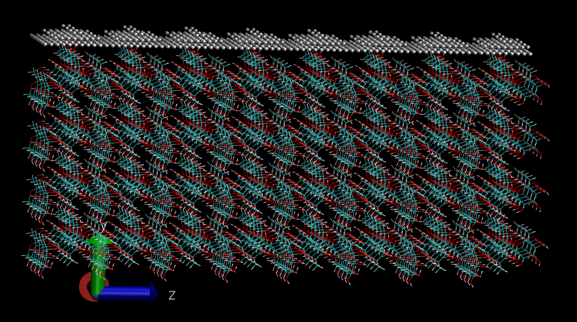
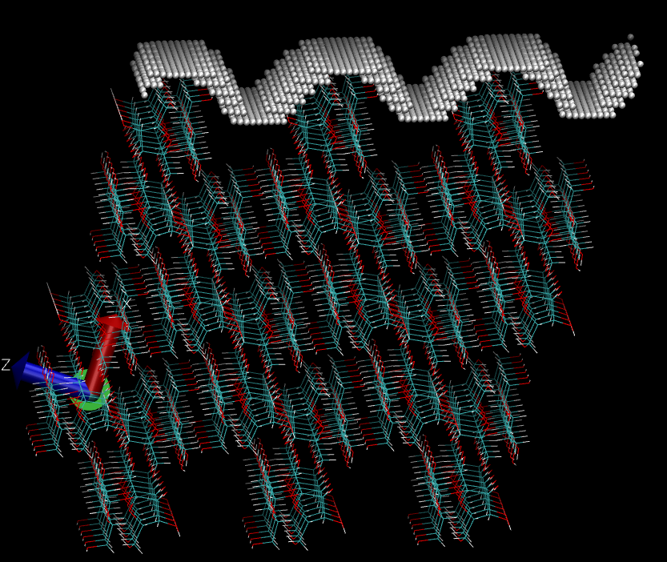

Computing Roughness
===================

In this tutorial we will explain the steps to compute 
a crystal surface Roughness defined as the ration between 
the "effective" surface and the "flat" surface.

We will hereby use sucrose as an example. We will analyse 
(100) and (10-1) crystal faces. Lattice information on 
sucrose was downloaded from `svn://www.crystallography.net/cod/cif/3/50/00/3500015.cif`

To this end we will use the following input file which can 
be also found under ``/examples/Roughness``::

  LCC{
    ClusterType=          Planes
    ClusterNumber=        2
    Verbose=  3
    LatticeBaseFile= "lattice_basis.xyz"
    WriteCml= F
    CheckPeriodicity= T

    ReadLatticeFromFile= F
    TypeOfLattice=        Triclinic
    LatticePoints=        30

    CheckLattice=         T

    PrimitiveFormat=      Angles
    AtomType=             At
    UseLatticeBase=       T
    BaseFormat=           abc
    CutAfterAddingBase=   F

    LatticeConstanta=     7.789
    LatticeConstantb=     8.743
    LatticeConstantc=     10.883

    LatticeAngleAlpha=     90
    LatticeAngleBeta=      102.760
    LatticeAngleGamma=     90
    RCoeff= 0.0

    CenterAtBox=       T
    Reorient=          T

    #+X,+Y,+Z
    #-X,1/2+Y,-Z
    SymmetryOperations= T
    NumberOfOperations= 2
    OptimalTranslations= F
    Translations[
     1  0   1   -1
     0  1   2   0.5
    ]
    Symmetries[
       1  1  1
      -1  1 -1
    ]

    NumberOfPlanes=   6

    ComputeRoughness= T
    RoughnessParameters[
      50.0 1.0 40 80 80
    ]

    Planes[
      1  0   0   2.5
      -1  0  0   1.5
      0  1   0   4.5
      0  -1  0   3.5
      0  0   1   2.5
      0  0   -1   1.5
    ]

    #Planes[
      1  0   -1   2.5
      -1  0  1   1.5
      0 -1   0   4.5
      0  1  0   1.5
      1  0   1   4.5
      -1  0   -1   1.5
    ]

  }

The "basis" needs to be provided via the ``lattice_basis.xyz`` file. The
content of such file is provided below and can also be found under 
``/examples/Roughness``::

  45
  #Sucrose basis
  O  0.63189     0.34908    0.62279
  O  0.7136      0.2018     0.41867
  O  0.6440      -0.0665    0.6512
  O  0.2978      -0.0008    0.69117
  O  0.2529      0.3114     0.77094
  O  0.60891     0.40061    0.82857
  O  0.68400     0.65323    0.78776
  O  0.3785      0.5127     0.97000
  O  0.9607      0.5091     0.67341
  O  1.0893      0.6500     1.02195
  O  0.7957      0.42950    1.07412
  C  0.7053      0.1955     0.64075
  C  0.5578      0.0769     0.6265
  C  0.4362      0.1116     0.71451
  C  0.3651      0.2728     0.6871
  C  0.5149      0.3897     0.70028
  C  0.8157      0.1767     0.5431
  C  0.6306      0.5556     0.87572
  C  0.8718      0.6862     0.82381
  C  0.9441      0.5804     0.93500
  C  0.7861      0.5573     0.99233
  C  0.4569      0.6161     0.8967
  C  0.9532      0.6662     0.7110
  H  0.7813      0.1873     0.7252
  H  0.4894      0.0781     0.5393
  H  0.5018      0.1046     0.8022
  H  0.2953      0.2763     0.6004
  H  0.4639      0.4900     0.6734
  H  0.9127      0.2488     0.5604
  H  0.8647      0.0743     0.5487
  H  0.733       0.298      0.402
  H  0.2287      0.0165     0.7364
  H  0.2152      0.3986     0.7560
  H  0.8878      0.7925     0.8526
  H  0.9806      0.4827     0.9048
  H  0.7738      0.6491     1.0414
  H  0.4764      0.7140     0.9395
  H  0.3769      0.6323     0.8158
  H  0.3772      0.4263     0.9405
  H  0.8853      0.7242     0.6409
  H  1.0716      0.7077     0.7308
  H  0.860       0.480      0.654
  H  1.185       0.604      1.009
  H  0.8058      0.3509     1.0352
  H  0.553      -0.128      0.642

The first run we will do needs to have the first plane listed 
uncommented. Note that the first plane listed will be the 
one used to compute the roughness. After executing lcc as 
follows::

  lcc_main sucrose.in 

We will get information about the surfa areas S1 (effective) and S0 
(flat) surface areas, together with their ratios.

The run will also produce a file called ``mask.xyz`` which contains 
a set of coordinates showing the surface pattern of the crystal 
face (``vmd -e mystate.vmd``). 

If we now uncomment the second plane (10-1) and rerun we will 
see the following surface:

The parameters controlling these computations in the input 
file are the following::

  ComputeRoughness= T
  RoughnessParameters[
  50.0 1.0 40 80 80
  ]

The first value controls the isovalue to compute the surface, the
second value controls the radius of the "probe sphere" used to 
construct the surface, the third, fourth and fifth values control
the discretization along the a1, a2, and a3 axis respectivelly. 

