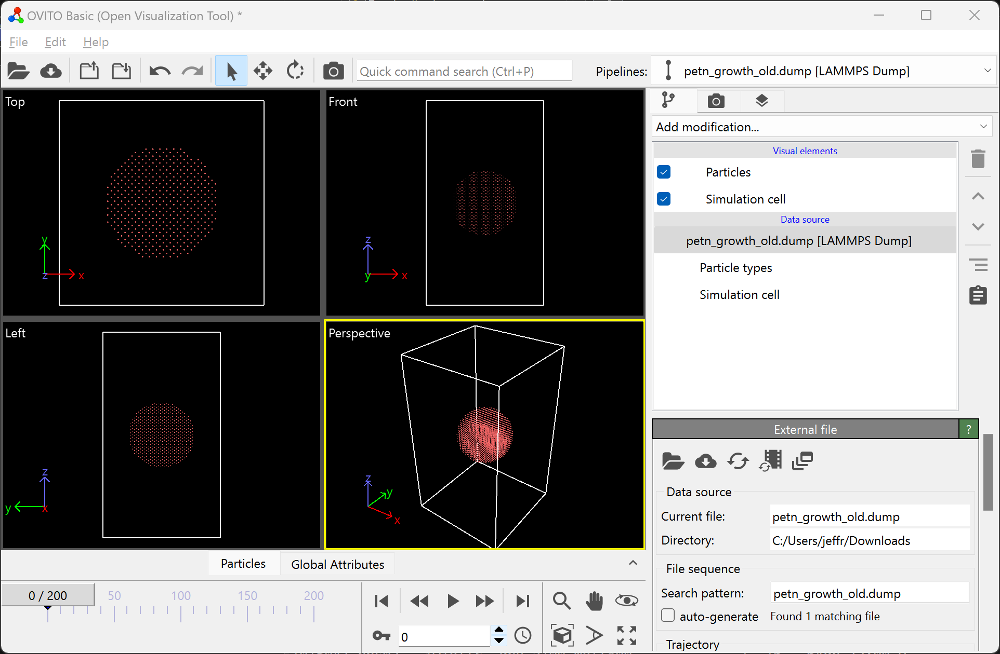
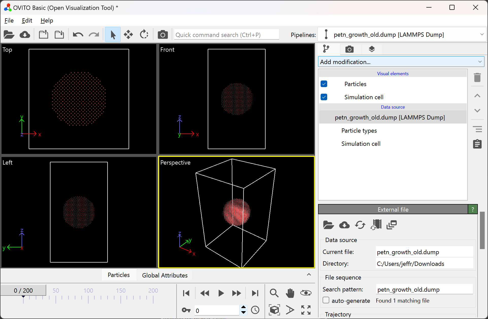
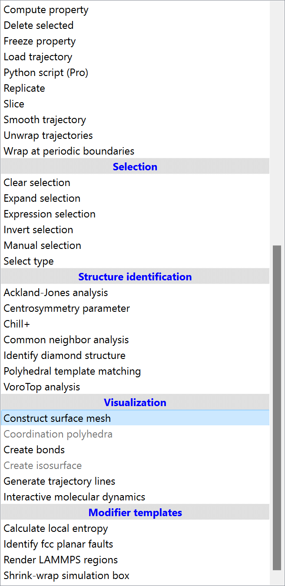
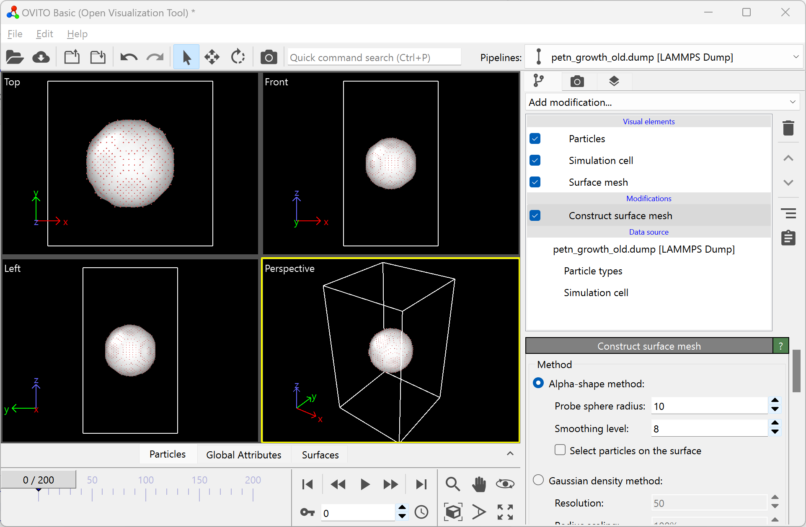
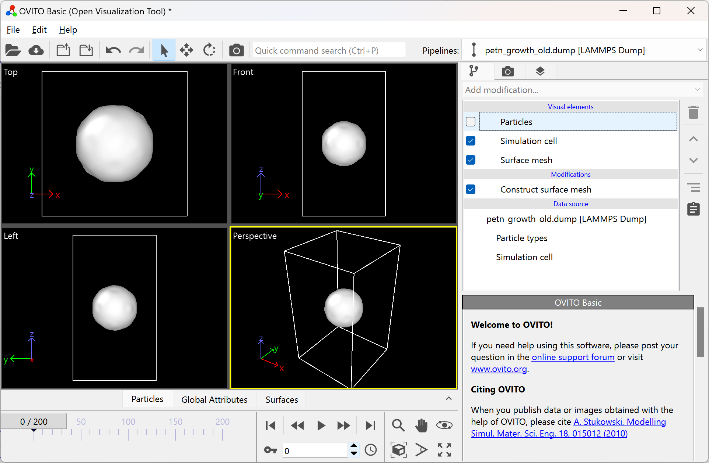
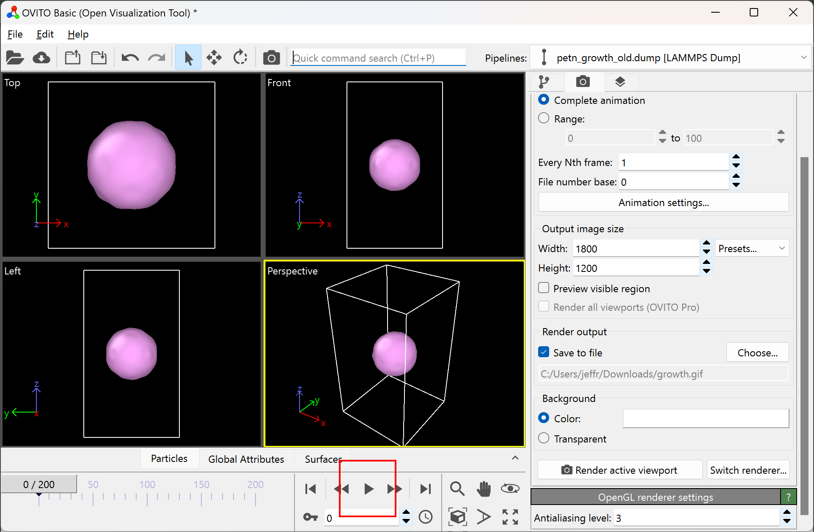
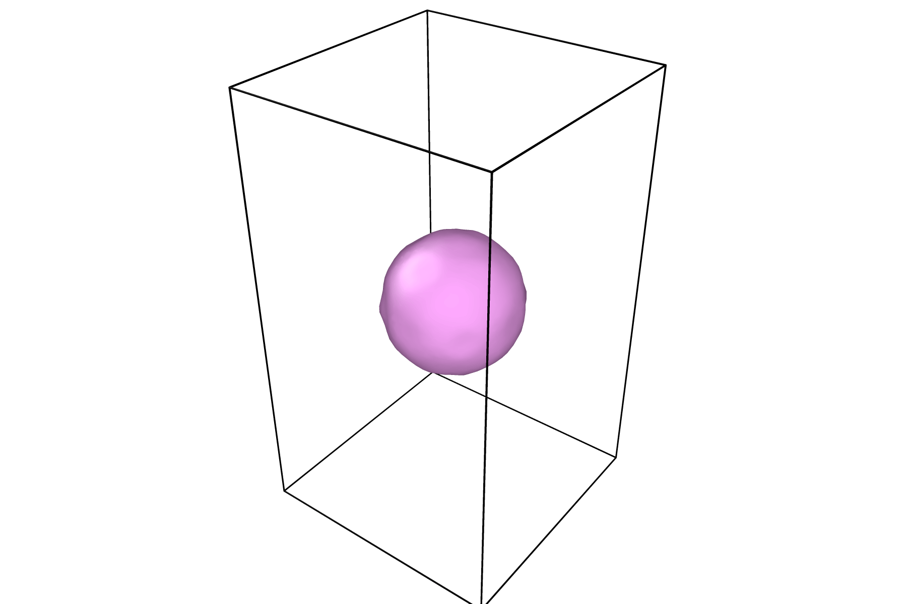

.. role:: raw-math(raw)
    :format: latex html

.. _OVITO: https://www.ovito.org/

.. _rendering: https://ovito.org/manual/usage/rendering.html

Kinetic Monte Carlo Crystal Growth Tool
----------------------------------------

About
######

This folder contains a Python script ``growth_kmc.py`` which performs a Kinetic
Monte Carlo simulation of crystal growth from solution, starting with a spherical
seed. The core developer of this tool is Jacob Jeffries (jwjeffr@clemson.edu
or jwjeffr@lanl.gov).

Lattice Styles
##############

Two lattice styles are currently supported, which are PETNMolecular and PETNBlock.

The PETNMolecular lattice style initializes sites at the positions:

:raw-math:`$$\mathbf{r}_{ijk\ell} = i\mathbf{a} + j\mathbf{b} + k\mathbf{c} + \ell\mathbf\Delta{r}$$`

where :raw-math:`$i$`, :raw-math:`$j$`, and :raw-math:`$k$` are any integers, and :raw-math:`$\ell$` is restricted to :raw-math:`$0$` and :raw-math:`$1$`. This style is for lattices whose unit cells contain two atoms or molecules and whose basis
vectors are orthogonal, where :raw-math:`$\mathbf{r}_{ijk0}$` is the position of one atom in the unit cell, 
and :raw-math:`$\mathbf{r}_{ijk1}$` is the position of the other. See :code:`example_molecular.json` to see this lattice style
used in an input file.

The PETNBlock lattice style initializes sites at the positions:

:raw-math:`$$\mathbf{r}_{ijk} = i\mathbf{a} + j\mathbf{b} + k\mathbf{c}$$`

where :raw-math:`$i$`, :raw-math:`$j$`, and :raw-math:`$k$` are any integers. This style is for lattices whose unit cells
contain one atom or molecule and whose basis vectors are orthogonal. See :code:`example_block.json` or :code:`example_block_reconstruction.json` to see this lattice style used in an input file.

Energetics styles
#################

Two energetics styles are currently supported, which are IsotropicSecondNearest and
AnisotropicThirdNearest.

The IsotropicSecondNearest energetics style stores interaction energies between first
and second nearest neighbors, specified by the first nearest cutoff and second nearest
cutoff. In the input file, the cutoffs are specified as :code:`first_cutoff` and 
:code:`second_cutoff`, and the respective interaction energies are specified as :code:`first_energy`
and :code:`second_energy`. See :code:`example_molecular.json` to see this energetics style used
in an input file.

The AnisotropicThirdNearest energetics style stores interaction energies between first,
second, and third nearest neighbors. First nearest neighbor interactions depend on direction.
In the input file, the first nearest neighbor interactions in the :code:`a`, :code:`b`, and
:code:`c` directions are respectively specified by :code:`e_1a`, :code:`e_1b`, and :code:`e_1c`.
The second nearest neighbor interactions in the :code:`b + c`, :code:`b - c`, :code:`c + a`,
:code:`-c + a`, :code:`a + b`, and :code:`a - b` directions are respectively specified by 
:code:`e_2a`, :code:`e_2a_p`, :code:`e_2b`, :code:`e_2b_p`, :code:`e_2c`, and :code:`e_2c_p`.
The third nearest neighbor interactions in the :code:`a + b + c`, :code:`a - b - c`, :code:`a - b + c`,
and :code:`a + b - c` directions are respectively specified by :code:`e_31`, :code:`e_32`, :code:`e_33`,
and :code:`e_34`. See :code:`example_block.json` to see this energetics style used in an input file.

The AnisotropicThirdNearestReconstruction energetics style is identical to the AnisotropicThirdNearest
energetics style, except all second-nearest and third-nearest interactions are the same, respectively
specified by :code:`second_nearest` and :code:`third_nearest`. See :code:`example_block_reconstruction.json`
to see this energetics style used in an input file.

Requirements
##############

-   The :code:`python` interpreter.

-   The external :code:`python` packages :code:`numpy` and :code:`numba`.

The example input (:code:`example_input.json`) provided works for Python 3.9.12,
Numpy 1.21.6, and Numba 0.55.1. Other versions are not guaranteed to be functional.

Testing and running the code
#############################

The code can be tested with:

  python growth_kmc.py example_molecular.json

or:

  ./growth_kmc.py example_molecular.json

Two runs will be performed:

-   A short, small run which first compiles functions. This run data will be stored in
    :code:`small.dump` in the LAMMPS-style dump format.

-   A longer run with parameters provided in :code:`example_molecular.json`. The parameters
    are:

    Box dimensions = (30, 30, 70) (in lattice units, so :raw-math:`$0 \leq i, j < 30$` and :raw-math:`$0 \leq k < 70$`)

    Number of steps = 100,000

    Dump every = 500 steps

    Dump file name = petn_growth_molecular.dump

    Initial seed radius = 75.0 angstroms

    Temperature = 300.0 kelvin

    a = 9.088 angstroms

    b = 9.088 angstroms

    c = 6.737 angstroms

    Energetics type = IsotropicSecondNearest

    First-neighbor cutoff distance = 7.0 angstroms

    Second-neighbor cutoff distance = 7.5 angstroms

    First-neighbor interaction energy = -0.291 electron volts

    Second-neighbor interaction energy = -0.186 electron volts

    Adsorption prefactor = 1e+10 hertz

    Adsorption barrier = 0.9 electron volts

    Evaporation prefactor = 1e+10 hertz

    Number of cpus to use = all

For new parameters, simply change the dictionary written in :code:`example_molecular.json` to
match your desired parameters. Note that the energetics and geometric parameters specified in
this file are optimized for a PETN crystal.

The above tests the PETNMolecular crystal style and the IsotropicSecondNearest energetics style.
To test the PETNBlock crystal style and the AnisotropicThirdNearest energetics style, run:

  python growth_kmc.py example_block.json

or:

  ./growth_kmc.py example_block.json

Notes
#####

This code is highly parallelized, and will use all available cores unless otherwise
specified in the input file. If cores are currently being used, your system might crash.
Specify a smaller number of cores with the :code:`num_cpus` input if necessary.

Visualizing Results
###################

This tool outputs data with the LAMMPS-style dump format. As such, any program that can visualize
LAMMPS-style dump files will allow you to visualize the output from this tool.

`OVITO`_ works particularly well with this tool since it has an internal tool for creating a surface mesh.
To visualize your data with a surface mesh, open OVITO and load in the output dump file:

Then, add the "Construct surface mesh" modification:

|pic1| |pic2|

After adding this modification, your OVITO window should look like:

To remove the particles in the visualization window, simply untick the "Particles" option in the top right:

If your surface mesh looks undesirable, try modifying the parameters of the modification.
You can do this by clicking on the surface mesh modification, and modifying the available parameters in the bottom right.

In this menu, you can also change the color of the mesh. If your intent is to use these images in a figure, be sure the color contrasts well with a white background.

Once your surface has a desirable shape and color, you can press the play icon to view the time evolution of the surface:

For information on how to render figures and/or movies, visit the OVITO documentation on `rendering`_.

