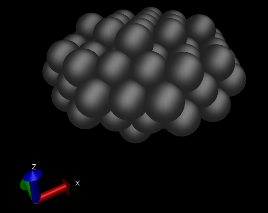

.. _RST regular:

Building regular shapes
=======================

`Congruence transformation <_static/doxy/index.html>`_
One can also build regular shapes, such
as for example a "spheroid." The parameters 
to do this can be entered as follows:::

  #Lcc input file.
  LCC{
   JobName=                 AgSpheroid        #Or any other name

   TypeOfLattice=           FCC
   LatticePoints=           50             #Number of point in each direction
   LatticeConstanta=        4.08
   AtomType=                Ag

   ClusterType=             Spheroid
   AAxis=                   10       #Radius in Ang for x direction 
   BAxis=                   10      #Radius in Ang for y direction 
   CAxis=                   5       #Radius in Ang for z direction 
  }

This will produce the following "oblate":

